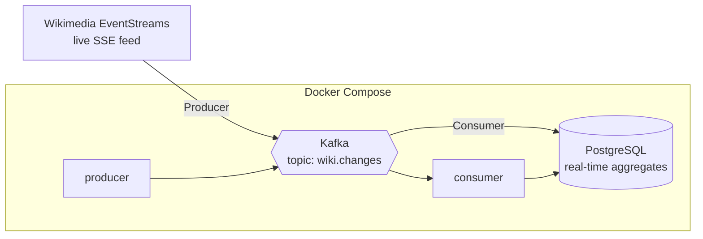

# 📡 Wikimedia Real-Time Streaming Pipeline

[](https://github.com/ibrahim-yeryaran/wikimedia-realtime-pipeline/actions/workflows/ci.yml)

A **real-time data streaming pipeline** that ingests Wikipedia's live edit feed,
streams it through **Apache Kafka**, and computes running aggregates in
**PostgreSQL** — all containerized with **Docker Compose**.

The data source is genuinely live: [Wikimedia EventStreams](https://stream.wikimedia.org/v2/stream/recentchange)
emits every edit happening across all Wikipedia/Wikimedia projects as it occurs.
No API key, no simulation — real events, in real time.

---

## 🏗️ Architecture



**Flow:** the **producer** subscribes to the live SSE feed and publishes each edit
to Kafka → the **consumer** reads from Kafka and upserts running aggregates into
PostgreSQL (edits per wiki, edits per minute).

---

## 🧰 Tech Stack

| Component        | Technology                                  |
| ---------------- | ------------------------------------------- |
| Streaming broker | Apache Kafka 3.8 (**KRaft mode**, no ZooKeeper) |
| Producer / Consumer | Python + `confluent-kafka`               |
| Storage          | PostgreSQL 15                               |
| Source           | Wikimedia EventStreams (SSE, public, no key) |
| Containerization | Docker Compose                              |

---

## 📁 Project Structure

```
wikimedia-realtime-pipeline/
├── producer/
│   ├── produce.py          # SSE feed → Kafka (auto-reconnect, acks=all)
│   ├── requirements.txt
│   └── Dockerfile
├── consumer/
│   ├── consume.py          # Kafka → PostgreSQL (at-least-once, batched upserts)
│   ├── requirements.txt
│   └── Dockerfile
├── db/
│   └── init.sql            # aggregate tables (wiki_totals, edits_per_minute)
└── docker-compose.yml      # Kafka + Postgres + producer + consumer
```

---

## 🚀 Getting Started

### Prerequisites
- Docker + Docker Compose

### Run the whole pipeline
```bash
docker-compose up --build -d
```
This starts Kafka, PostgreSQL, the producer, and the consumer. Within seconds the
producer begins streaming live edits and the consumer starts writing aggregates.

### Watch it work
```bash
# Producer streaming live events
docker logs -f wiki_producer

# Consumer writing to Postgres
docker logs -f wiki_consumer
```

### Query the real-time results
```bash
docker exec -it stream_postgres psql -U stream -d wikistream -c \
  "SELECT server_name, total_edits FROM wiki_totals ORDER BY total_edits DESC LIMIT 10;"
```

### Stop
```bash
docker-compose down          # keep data
docker-compose down -v       # also wipe the Postgres volume
```

---

## 🗄️ Data Model

**`wiki_totals`** — running totals per wiki (for "most active wikis right now")

| Column               | Description                         |
| -------------------- | ----------------------------------- |
| `server_name`        | e.g. `en.wikipedia.org` (PK)        |
| `total_edits`        | running edit count                  |
| `total_bytes_change` | net bytes added/removed             |
| `last_seen_at`       | timestamp of the latest edit        |

**`edits_per_minute`** — time-series traffic (minute bucket × wiki)

| Column          | Description                          |
| --------------- | ------------------------------------ |
| `minute_bucket` | edit time truncated to the minute    |
| `server_name`   | wiki                                 |
| `edit_count`    | edits in that minute for that wiki   |

---

## 🧠 Streaming Design Decisions

- **Kafka in KRaft mode** — no separate ZooKeeper service; a single, modern,
  self-managed broker.
- **Auto-reconnect with exponential backoff** — the SSE feed *will* drop; the
  producer reconnects gracefully instead of crashing.
- **`acks=all` + compression + linger** — durable, efficient batched writes.
- **Partition key = `server_name`** — edits from the same wiki keep their order.
- **At-least-once delivery** — the consumer commits to Postgres *before* committing
  Kafka offsets, so a crash never loses events (it may reprocess a few). Upserts
  keep the aggregates consistent under reprocessing.
- **Manual offset commits, batched** — consumption and persistence stay in sync.

---

## 📊 Example Queries

```sql
-- Most active wikis right now
SELECT server_name, total_edits
FROM wiki_totals
ORDER BY total_edits DESC
LIMIT 10;

-- Global edit traffic over the last 10 minutes
SELECT minute_bucket, sum(edit_count) AS edits
FROM edits_per_minute
GROUP BY minute_bucket
ORDER BY minute_bucket DESC
LIMIT 10;
```

---

## 🛣️ Possible Extensions

- Add a **Kafka Streams / Flink** job for windowed aggregations instead of doing
  them in the consumer.
- Expose the aggregates through a **Streamlit / Grafana** real-time dashboard.
- Add a **schema registry** (Avro/Protobuf) for typed messages.
- Scale out: multiple partitions + multiple consumer instances in the same group.
- For production, set replication factor to 3 across multiple brokers.

---

## 📄 License

MIT — feel free to use this as a learning reference.
